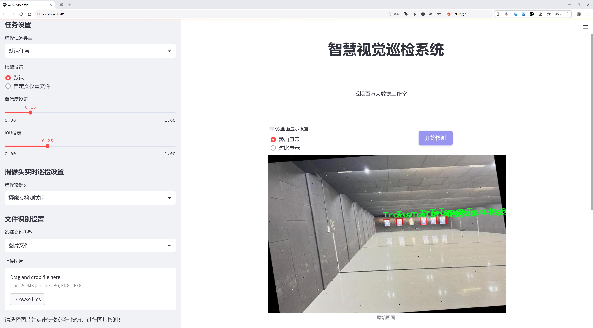
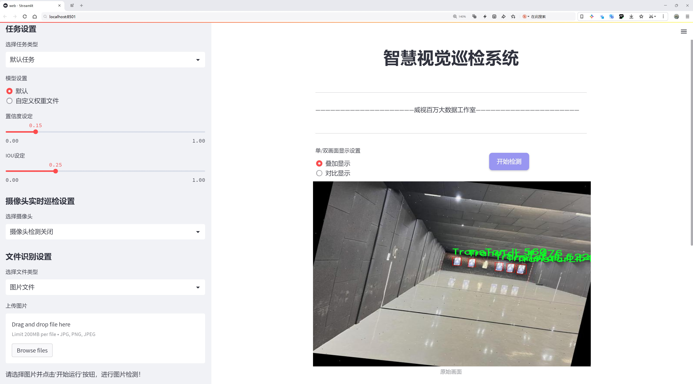
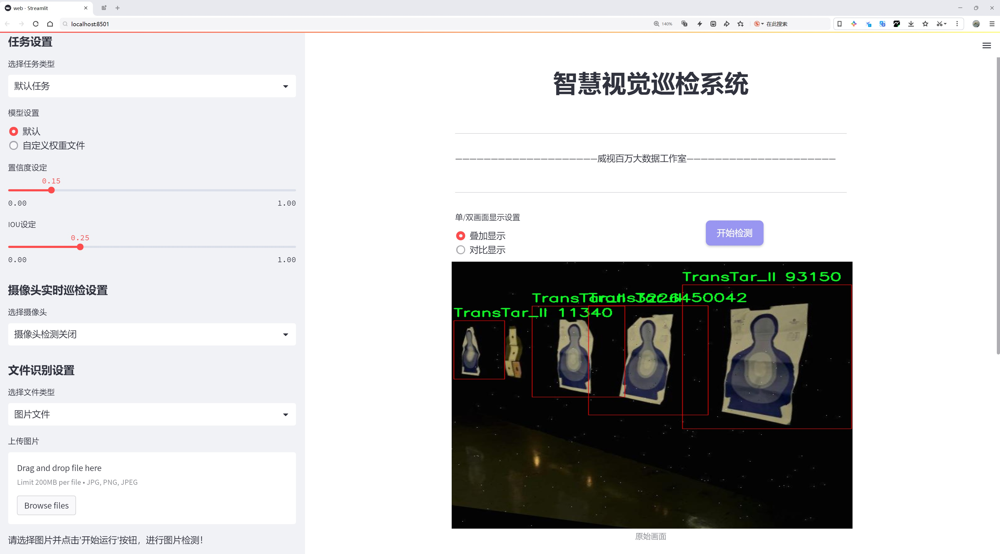
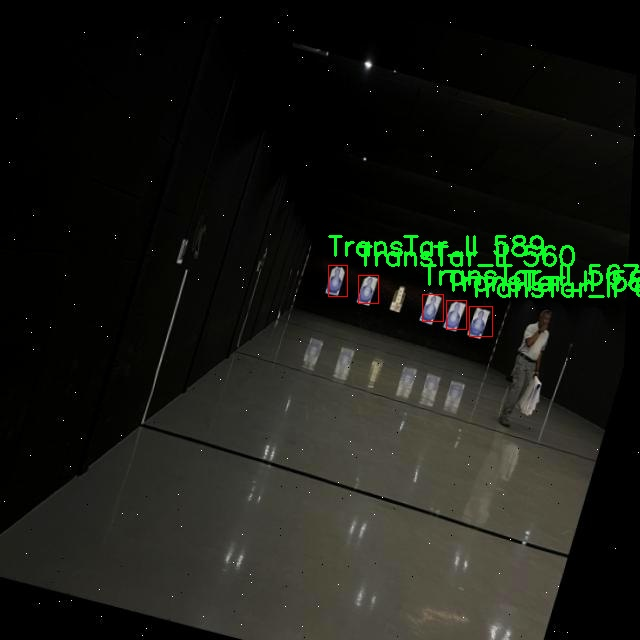
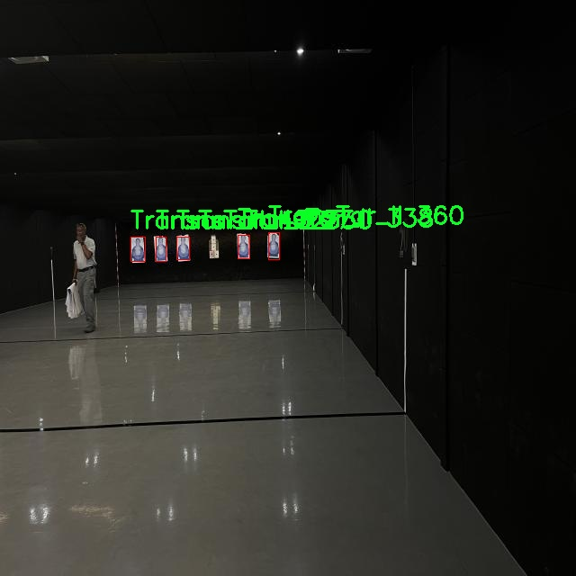
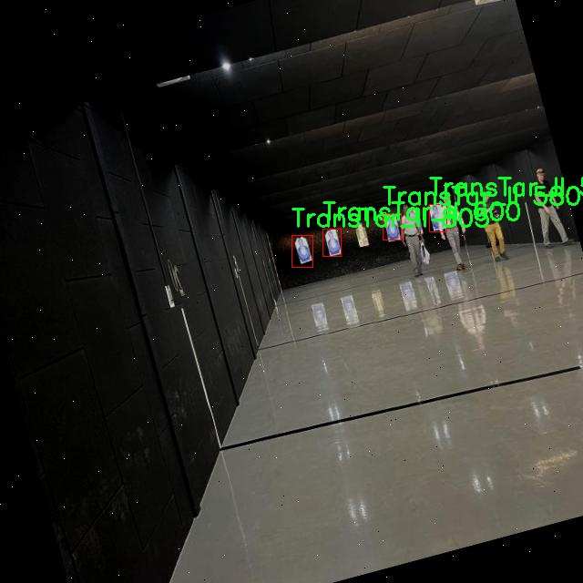
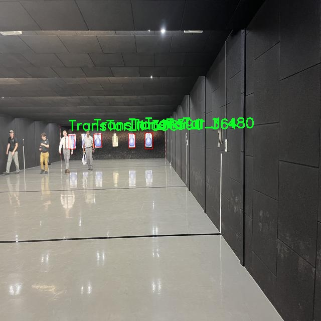
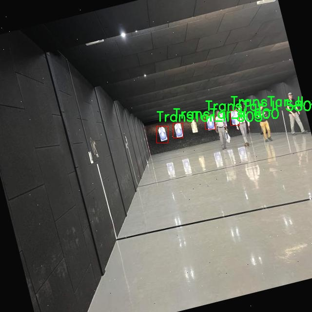

# 射击靶标检测检测系统源码分享
 # [一条龙教学YOLOV8标注好的数据集一键训练_70+全套改进创新点发刊_Web前端展示]

### 1.研究背景与意义

项目参考[AAAI Association for the Advancement of Artificial Intelligence](https://gitee.com/qunshansj/projects)

项目来源[AACV Association for the Advancement of Computer Vision](https://gitee.com/qunmasj/projects)

研究背景与意义

随着计算机视觉技术的迅速发展，目标检测在多个领域中得到了广泛应用，尤其是在安防监控、自动驾驶、工业检测等领域。射击靶标检测作为目标检测的一种特殊应用，具有重要的现实意义和研究价值。射击靶标的准确识别和定位不仅能够提高射击训练的效率，还能在军事演习和体育竞赛中发挥关键作用。因此，开发一个高效、准确的射击靶标检测系统显得尤为重要。

近年来，YOLO（You Only Look Once）系列模型因其优越的实时性和准确性而受到广泛关注。YOLOv8作为该系列的最新版本，进一步提升了目标检测的性能，尤其是在复杂背景和多目标场景下的表现。然而，尽管YOLOv8在许多应用中表现出色，但在特定领域如射击靶标检测中，仍然存在一些挑战。射击靶标的多样性、环境的复杂性以及不同射击距离对靶标识别的影响，都是影响检测效果的重要因素。因此，基于改进YOLOv8的射击靶标检测系统的研究，具有重要的理论意义和实际应用价值。

本研究将利用MARS（CombinedDatasets）数据集，该数据集包含2500张图像，专注于单一类别的靶标检测，具体为TransTar_II。这一数据集的构建为研究提供了丰富的样本，能够有效支持模型的训练和测试。通过对该数据集的深入分析，我们可以更好地理解射击靶标在不同场景下的特征，从而为模型的改进提供依据。数据集的单一类别特性，使得模型在学习过程中能够集中关注靶标的特征提取，减少了因类别多样性带来的干扰，进而提高了检测的准确性。

此外，改进YOLOv8的射击靶标检测系统不仅可以提升靶标识别的精度，还能够在实时性方面进行优化。通过对YOLOv8的网络结构进行调整和优化，结合特定的射击靶标特征，我们期望能够实现更高的检测速度和更低的计算资源消耗。这对于实际应用场景中的实时监控和反馈系统尤为重要，能够有效支持射击训练和赛事的实时评估。

综上所述，基于改进YOLOv8的射击靶标检测系统的研究，不仅为目标检测领域提供了新的思路和方法，也为射击训练和相关应用提供了技术支持。通过深入挖掘MARS数据集中的信息，结合先进的深度学习技术，我们有望在靶标检测的准确性和实时性上取得突破，为相关领域的发展贡献力量。这一研究不仅具有重要的学术价值，也将为实际应用提供有力的技术保障，推动射击靶标检测技术的进步。

### 2.图片演示







##### 注意：由于此博客编辑较早，上面“2.图片演示”和“3.视频演示”展示的系统图片或者视频可能为老版本，新版本在老版本的基础上升级如下：（实际效果以升级的新版本为准）

  （1）适配了YOLOV8的“目标检测”模型和“实例分割”模型，通过加载相应的权重（.pt）文件即可自适应加载模型。

  （2）支持“图片识别”、“视频识别”、“摄像头实时识别”三种识别模式。

  （3）支持“图片识别”、“视频识别”、“摄像头实时识别”三种识别结果保存导出，解决手动导出（容易卡顿出现爆内存）存在的问题，识别完自动保存结果并导出到tempDir中。

  （4）支持Web前端系统中的标题、背景图等自定义修改，后面提供修改教程。

  另外本项目提供训练的数据集和训练教程,暂不提供权重文件（best.pt）,需要您按照教程进行训练后实现图片演示和Web前端界面演示的效果。

### 3.视频演示

[3.1 视频演示](https://www.bilibili.com/video/BV1zCtQekEyM/)

### 4.数据集信息展示

##### 4.1 本项目数据集详细数据（类别数＆类别名）

nc: 1
names: ['TransTar_II']


##### 4.2 本项目数据集信息介绍

数据集信息展示

在本研究中，我们使用了名为“MARS(CombinedDatasets)”的数据集，以支持对YOLOv8射击靶标检测系统的改进与优化。该数据集专门设计用于提升计算机视觉模型在射击靶标识别任务中的性能，尤其是在复杂环境下的目标检测能力。MARS数据集的构建基于多种来源的合成数据，旨在提供一个全面而多样化的训练基础，以便模型能够在不同场景和条件下进行有效的靶标检测。

MARS数据集的类别数量为1，具体类别为“TransTar_II”。这一类别代表了一种特定类型的射击靶标，具有独特的视觉特征和结构设计。TransTar_II靶标的设计考虑了射击训练的实际需求，通常具有高对比度的颜色和清晰的边界，以便于在不同光照条件下被识别。通过对这一靶标的专注，MARS数据集能够为YOLOv8模型提供针对性的训练数据，帮助其在检测过程中更好地捕捉到靶标的细节。

在数据集的构建过程中，MARS数据集不仅涵盖了多种拍摄角度和距离，还考虑了不同的背景环境和光照条件。这种多样性确保了模型在训练时能够接触到各种可能的实际应用场景，从而提高其泛化能力。通过使用MARS数据集，YOLOv8模型将能够在真实世界中更准确地识别和定位TransTar_II靶标，提升射击训练的效率和安全性。

此外，MARS数据集还包含了丰富的标注信息，每个样本都经过精确的标注，以确保模型在训练过程中能够获得准确的监督信号。这些标注不仅包括靶标的位置和类别信息，还可能涉及靶标的状态和其他相关特征，进一步增强了数据集的实用性和有效性。通过这种方式，研究者能够确保模型在训练过程中充分理解靶标的特征，从而提高检测的准确性和可靠性。

在数据预处理阶段，MARS数据集也经过了精心的处理，以适应YOLOv8模型的输入要求。包括图像的缩放、归一化以及数据增强等技术，确保模型在训练时能够获得更为丰富和多样化的样本。这些处理不仅提高了模型的训练效率，还增强了其在面对不同环境变化时的鲁棒性。

总之，MARS(CombinedDatasets)数据集为改进YOLOv8射击靶标检测系统提供了坚实的基础。通过对TransTar_II靶标的深入研究和数据集的精心设计，我们期望能够显著提升模型在靶标检测任务中的表现，为射击训练的智能化和自动化发展贡献力量。随着研究的深入，我们相信MARS数据集将为未来的相关研究提供宝贵的参考和借鉴。











### 5.全套项目环境部署视频教程（零基础手把手教学）

[5.1 环境部署教程链接（零基础手把手教学）](https://www.ixigua.com/7404473917358506534?logTag=c807d0cbc21c0ef59de5)


[5.2 安装Python虚拟环境创建和依赖库安装视频教程链接（零基础手把手教学）](https://www.ixigua.com/7404474678003106304?logTag=1f1041108cd1f708b01a)

### 6.手把手YOLOV8训练视频教程（零基础小白有手就能学会）

[6.1 手把手YOLOV8训练视频教程（零基础小白有手就能学会）](https://www.ixigua.com/7404477157818401292?logTag=d31a2dfd1983c9668658)

### 7.70+种全套YOLOV8创新点代码加载调参视频教程（一键加载写好的改进模型的配置文件）

[7.1 70+种全套YOLOV8创新点代码加载调参视频教程（一键加载写好的改进模型的配置文件）](https://www.ixigua.com/7404478314661806627?logTag=29066f8288e3f4eea3a4)

### 8.70+种全套YOLOV8创新点原理讲解（非科班也可以轻松写刊发刊，V10版本正在科研待更新）

由于篇幅限制，每个创新点的具体原理讲解就不一一展开，具体见下列网址中的创新点对应子项目的技术原理博客网址【Blog】：


[8.1 70+种全套YOLOV8创新点原理讲解链接](https://gitee.com/qunmasj/good)

### 9.系统功能展示（检测对象为举例，实际内容以本项目数据集为准）

图9.1.系统支持检测结果表格显示

  图9.2.系统支持置信度和IOU阈值手动调节

  图9.3.系统支持自定义加载权重文件best.pt(需要你通过步骤5中训练获得)

  图9.4.系统支持摄像头实时识别

  图9.5.系统支持图片识别

  图9.6.系统支持视频识别

  图9.7.系统支持识别结果文件自动保存

  图9.8.系统支持Excel导出检测结果数据


### 10.原始YOLOV8算法原理

原始YOLOv8算法原理

YOLOv8算法作为目标检测领域的最新进展，继承并发展了YOLO系列模型的优良传统，致力于在速度与精度之间找到最佳平衡。其架构由输入层、主干网络、颈部网络和头部网络四个主要组件构成，形成了一个高效的目标检测体系。首先，输入层负责将待检测的图像进行缩放，以满足模型对输入尺寸的要求。这一过程确保了不同尺寸的图像能够被统一处理，从而提升了模型的适应性和通用性。

在主干网络中，YOLOv8采用了卷积操作来对输入图像进行下采样，提取出丰富的特征信息。每个卷积层都包含批归一化和SiLUR激活函数，这种设计不仅提高了模型的收敛速度，还增强了其非线性表达能力。主干网络的核心在于C2f块的引入，这一模块借鉴了YOLOv7中的E-ELAN结构，通过跨层分支连接的方式，促进了模型的梯度流动，进而改善了目标检测的效果。C2f块的设计使得不同层次的特征能够有效地相互融合，从而提升了特征的多样性和丰富性。

主干网络的末尾，YOLOv8引入了SPPFl块，利用三个最大池化层对多尺度特征进行处理。这一设计旨在增强网络的特征抽象能力，使得模型能够更好地捕捉到不同尺度下的目标信息。通过这种多尺度特征的提取，YOLOv8能够在复杂场景中保持较高的检测精度。

接下来，颈部网络的设计则是为了有效融合来自主干网络的不同尺度特征图。YOLOv8采用了FPNS（特征金字塔网络）和PAN（路径聚合网络）结构，这两者的结合使得特征信息的传递更加高效。FPNS负责将高层特征与低层特征进行融合，确保模型能够利用到丰富的上下文信息，而PAN则通过跨层连接，进一步提升了特征的表达能力和检测的准确性。

在头部网络中，YOLOv8采用了解耦的检测头，这一创新设计通过两个并行的卷积分支分别计算回归和类别的损失。这样的解耦设计使得模型在进行目标检测时，能够更加专注于每个任务的特定需求，从而提升了整体的检测性能。与传统的耦合头相比，解耦头在处理复杂场景时展现出了更高的灵活性和适应性。

YOLOv8算法的核心思想在于高效性与准确性的统一。其在骨干网络中继续采用跨级结构（CSP）的理念，但对YOLOv5中的C3模块进行了优化，替换为更轻量的结构。这一改进不仅降低了模型的计算复杂度，还保持了较高的特征提取能力。此外，YOLOv8依然保留了空间金字塔池化模块，确保了多尺度特征的有效处理。

在损失计算方面，YOLOv8引入了新的损失策略，通过变焦损失来计算分类损失，同时使用数据平均保真度损失和完美交并比损失来计算边界框损失。这种新颖的损失计算方式使得模型在训练过程中能够更加准确地优化目标检测性能，从而在复杂场景中实现更高的检测精度。

基于上述的设计与改进，YOLOv8不仅在效率上有了显著提升，还在准确性上达到了新的高度。通过新的样本匹配方式，YOLOv8能够在保证高效率的基础上，进行更加精确的目标检测。这一系列的优化使得YOLOv8在实际应用中表现出色，成为目标检测领域的重要工具。

在轻量化的YOLOv8n目标检测模型中，进一步的优化则体现在特征提取网络的设计上。YOLOv8n使用了更轻量化的C2F模块，替代了原有的C3模块，并将卷积操作简化为3×3的形式，深度也进行了相应的调整。这一变化使得YOLOv8n在保持检测性能的同时，显著降低了模型的复杂度和计算资源的消耗。

特征融合层的设计同样进行了优化，减少了降采样层的数量，并用C2F模块替换了C3模块，以提升特征融合的效率。在检测头层，YOLOv8n采用了轻量化的解耦头，进一步优化了目标检测的性能。这种有错目标检测的方式取代了传统的无锚目标检测，使得模型在面对复杂场景时，能够更加灵活地进行目标识别与定位。

综上所述，YOLOv8算法通过一系列创新的设计与优化，不仅提升了目标检测的效率与准确性，还为后续的研究与应用提供了新的思路与方向。随着目标检测技术的不断发展，YOLOv8无疑将在各类实际应用中发挥重要作用，推动智能视觉技术的进一步进步。


### 11.项目核心源码讲解（再也不用担心看不懂代码逻辑）

#### 11.1 ui.py

以下是对代码的核心部分进行提炼和详细注释的版本：

```python
import sys
import subprocess

def run_script(script_path):
    """
    使用当前 Python 环境运行指定的脚本。

    Args:
        script_path (str): 要运行的脚本路径

    Returns:
        None
    """
    # 获取当前 Python 解释器的路径
    python_path = sys.executable

    # 构建运行命令，使用 streamlit 运行指定的脚本
    command = f'"{python_path}" -m streamlit run "{script_path}"'

    # 执行命令并等待其完成
    result = subprocess.run(command, shell=True)
    
    # 检查命令执行的返回码，非零表示出错
    if result.returncode != 0:
        print("脚本运行出错。")

# 程序入口
if __name__ == "__main__":
    # 指定要运行的脚本路径
    script_path = "web.py"  # 假设脚本在当前目录下

    # 调用函数运行脚本
    run_script(script_path)
```

### 代码分析与注释：

1. **导入模块**：
   - `sys`：用于访问与 Python 解释器相关的变量和函数。
   - `subprocess`：用于执行外部命令和与其交互。

2. **`run_script` 函数**：
   - 功能：该函数接收一个脚本路径，并使用当前 Python 环境来运行该脚本。
   - 参数：
     - `script_path`：要运行的 Python 脚本的路径。
   - 实现步骤：
     - 获取当前 Python 解释器的路径，使用 `sys.executable`。
     - 构建命令字符串，使用 `streamlit` 模块来运行指定的脚本。
     - 使用 `subprocess.run` 执行命令，`shell=True` 允许在 shell 中执行命令。
     - 检查命令的返回码，如果返回码不为 0，表示脚本运行出错，打印错误信息。

3. **程序入口**：
   - 使用 `if __name__ == "__main__":` 确保只有在直接运行该脚本时才会执行以下代码。
   - 指定要运行的脚本路径（这里假设为 `"web.py"`）。
   - 调用 `run_script` 函数，传入脚本路径以执行该脚本。

### 总结：
这段代码的核心功能是通过当前 Python 环境运行指定的脚本，并处理可能出现的错误。

这个文件名为 `ui.py`，它的主要功能是运行一个指定的 Python 脚本，具体来说是通过 Streamlit 框架来启动一个 Web 应用。文件中首先导入了必要的模块，包括 `sys`、`os` 和 `subprocess`，这些模块分别用于处理系统相关的操作、文件路径和执行外部命令。

在 `run_script` 函数中，首先获取当前 Python 解释器的路径，这样可以确保在正确的环境中运行脚本。接着，构建了一个命令字符串，该命令使用 Streamlit 来运行指定的脚本路径。命令的格式是 `python -m streamlit run script_path`，其中 `script_path` 是传入的参数。

随后，使用 `subprocess.run` 方法执行这个命令。这个方法会在一个新的进程中运行命令，并等待其完成。如果脚本运行过程中出现错误，返回的 `returncode` 将不为零，程序会打印出“脚本运行出错”的提示。

在文件的最后部分，使用 `if __name__ == "__main__":` 语句来确保当该文件作为主程序运行时，才会执行以下代码。这里指定了要运行的脚本路径为 `web.py`，并调用 `run_script` 函数来启动这个脚本。

总体来说，这个文件的功能是简洁明了的，主要用于在特定的 Python 环境中启动一个 Streamlit Web 应用。

#### 11.2 70+种YOLOv8算法改进源码大全和调试加载训练教程（非必要）\ultralytics\models\sam\model.py

以下是代码中最核心的部分，并附上详细的中文注释：

```python
from pathlib import Path  # 导入Path类，用于处理文件路径

from ultralytics.engine.model import Model  # 从Ultralytics引擎导入Model基类
from ultralytics.utils.torch_utils import model_info  # 导入模型信息工具

from .build import build_sam  # 导入构建SAM模型的函数
from .predict import Predictor  # 导入预测器类


class SAM(Model):
    """
    SAM（Segment Anything Model）接口类。

    SAM旨在实现可提示的实时图像分割。可以使用多种提示方式，如边界框、点或标签。该模型具有零-shot性能，并在SA-1B数据集上进行训练。
    """

    def __init__(self, model='sam_b.pt') -> None:
        """
        使用预训练模型文件初始化SAM模型。

        参数：
            model (str): 预训练SAM模型文件的路径。文件应具有.pt或.pth扩展名。

        异常：
            NotImplementedError: 如果模型文件扩展名不是.pt或.pth。
        """
        # 检查模型文件扩展名是否有效
        if model and Path(model).suffix not in ('.pt', '.pth'):
            raise NotImplementedError('SAM预测需要预训练的*.pt或*.pth模型。')
        super().__init__(model=model, task='segment')  # 调用父类构造函数

    def predict(self, source, stream=False, bboxes=None, points=None, labels=None, **kwargs):
        """
        对给定的图像或视频源执行分割预测。

        参数：
            source (str): 图像或视频文件的路径，或PIL.Image对象，或numpy.ndarray对象。
            stream (bool, optional): 如果为True，则启用实时流。默认为False。
            bboxes (list, optional): 用于提示分割的边界框坐标列表。默认为None。
            points (list, optional): 用于提示分割的点列表。默认为None。
            labels (list, optional): 用于提示分割的标签列表。默认为None。

        返回：
            (list): 模型的预测结果。
        """
        # 设置预测的覆盖参数
        overrides = dict(conf=0.25, task='segment', mode='predict', imgsz=1024)
        kwargs.update(overrides)  # 更新额外参数
        prompts = dict(bboxes=bboxes, points=points, labels=labels)  # 创建提示字典
        return super().predict(source, stream, prompts=prompts, **kwargs)  # 调用父类的预测方法

    def info(self, detailed=False, verbose=True):
        """
        记录有关SAM模型的信息。

        参数：
            detailed (bool, optional): 如果为True，则显示有关模型的详细信息。默认为False。
            verbose (bool, optional): 如果为True，则在控制台上显示信息。默认为True。

        返回：
            (tuple): 包含模型信息的元组。
        """
        return model_info(self.model, detailed=detailed, verbose=verbose)  # 返回模型信息
```

### 代码核心部分解释：
1. **导入模块**：导入必要的模块和类以支持模型的构建和预测。
2. **SAM类**：定义了一个SAM类，继承自Ultralytics的Model基类，专门用于图像分割任务。
3. **初始化方法**：在初始化时检查模型文件的有效性，并调用父类的构造函数。
4. **预测方法**：实现了对图像或视频源的分割预测，支持实时流和多种提示方式（边界框、点、标签）。
5. **信息方法**：提供模型的详细信息，可以选择是否显示详细信息和控制台输出。

这个程序文件是Ultralytics YOLO系列中的一个模块，主要用于实现Segment Anything Model（SAM）的接口，旨在处理实时图像分割任务。SAM模型具有很高的灵活性，能够根据不同的提示进行分割，并且在SA-1B数据集上进行了训练，具备零-shot性能，可以在没有先前知识的情况下适应新的图像分布和任务。

文件首先导入了一些必要的库和模块，包括路径处理的Path类、模型基类Model以及用于获取模型信息的model_info函数。接着，定义了一个名为SAM的类，该类继承自Model类，主要用于实现SAM模型的功能。

在类的初始化方法中，SAM模型会接收一个预训练模型文件的路径，文件应为.pt或.pth格式。如果提供的文件格式不符合要求，则会抛出NotImplementedError异常。初始化完成后，调用父类的构造函数，设置任务为“segment”。

_load方法用于加载指定的权重文件到SAM模型中，接收权重文件的路径和可选的任务名称作为参数。

predict方法是模型进行分割预测的核心功能，接收图像或视频源的路径、是否实时流式处理的标志、以及可选的边界框、点和标签等参数。该方法会构建一个包含默认参数的字典，并将用户提供的参数合并，最终调用父类的predict方法进行预测。

__call__方法是predict方法的别名，提供了相同的功能，允许用户通过调用实例直接进行预测。

info方法用于记录和返回SAM模型的信息，用户可以选择是否获取详细信息，并控制信息是否在控制台上显示。

最后，task_map属性提供了一个将“segment”任务映射到其对应的“Predictor”的字典，方便在不同任务之间进行管理和调用。

总体而言，这个文件实现了SAM模型的基本功能，包括模型的初始化、权重加载、预测和信息查询等，为图像分割任务提供了强大的支持。

#### 11.3 code\ultralytics\models\yolo\segment\train.py

以下是经过简化和注释的核心代码部分：

```python
# 导入必要的库和模块
from copy import copy
from ultralytics.models import yolo
from ultralytics.nn.tasks import SegmentationModel
from ultralytics.utils import DEFAULT_CFG, RANK
from ultralytics.utils.plotting import plot_images, plot_results

class SegmentationTrainer(yolo.detect.DetectionTrainer):
    """
    扩展DetectionTrainer类以基于分割模型进行训练的类。
    示例用法：
        ```python
        from ultralytics.models.yolo.segment import SegmentationTrainer

        args = dict(model='yolov8n-seg.pt', data='coco8-seg.yaml', epochs=3)
        trainer = SegmentationTrainer(overrides=args)
        trainer.train()
        ```
    """

    def __init__(self, cfg=DEFAULT_CFG, overrides=None, _callbacks=None):
        """初始化SegmentationTrainer对象，接受配置和重写参数。"""
        if overrides is None:
            overrides = {}
        overrides["task"] = "segment"  # 设置任务类型为分割
        super().__init__(cfg, overrides, _callbacks)  # 调用父类构造函数

    def get_model(self, cfg=None, weights=None, verbose=True):
        """返回初始化的SegmentationModel，使用指定的配置和权重。"""
        # 创建SegmentationModel实例，ch=3表示输入通道数，nc为类别数
        model = SegmentationModel(cfg, ch=3, nc=self.data["nc"], verbose=verbose and RANK == -1)
        if weights:
            model.load(weights)  # 如果提供了权重，则加载权重

        return model  # 返回模型实例

    def get_validator(self):
        """返回SegmentationValidator实例，用于YOLO模型的验证。"""
        self.loss_names = "box_loss", "seg_loss", "cls_loss", "dfl_loss"  # 定义损失名称
        return yolo.segment.SegmentationValidator(
            self.test_loader, save_dir=self.save_dir, args=copy(self.args), _callbacks=self.callbacks
        )  # 返回验证器实例

    def plot_training_samples(self, batch, ni):
        """创建训练样本图像的绘图，包括标签和边框坐标。"""
        plot_images(
            batch["img"],  # 图像数据
            batch["batch_idx"],  # 批次索引
            batch["cls"].squeeze(-1),  # 类别标签
            batch["bboxes"],  # 边框坐标
            masks=batch["masks"],  # 掩码数据
            paths=batch["im_file"],  # 图像文件路径
            fname=self.save_dir / f"train_batch{ni}.jpg",  # 保存图像的文件名
            on_plot=self.on_plot,  # 绘图回调
        )

    def plot_metrics(self):
        """绘制训练和验证指标的图表。"""
        plot_results(file=self.csv, segment=True, on_plot=self.on_plot)  # 保存结果图像
```

### 代码说明：
1. **导入模块**：引入必要的库和模块，以便后续使用。
2. **SegmentationTrainer类**：继承自`DetectionTrainer`，用于处理分割任务的训练。
3. **初始化方法**：设置任务类型为分割，并调用父类的初始化方法。
4. **获取模型**：创建并返回一个分割模型实例，可以选择加载预训练权重。
5. **获取验证器**：返回一个验证器实例，用于评估模型性能。
6. **绘制训练样本**：生成并保存训练样本的可视化图像，包含图像、标签和边框信息。
7. **绘制指标**：绘制训练和验证过程中的性能指标图表。

这个程序文件是用于训练YOLO（You Only Look Once）模型进行图像分割的。它定义了一个名为`SegmentationTrainer`的类，该类继承自`DetectionTrainer`，专门用于处理图像分割任务。

在类的构造函数`__init__`中，首先初始化了一些参数。如果没有提供覆盖参数`overrides`，则将其设置为空字典。接着，将任务类型设置为“segment”，并调用父类的构造函数进行初始化。

`get_model`方法用于返回一个初始化好的分割模型`SegmentationModel`。它接受配置文件`cfg`和权重文件`weights`作为参数。如果提供了权重文件，则会加载这些权重。

`get_validator`方法返回一个`SegmentationValidator`实例，用于验证YOLO模型的性能。在这个方法中，还定义了损失名称，包括边界框损失、分割损失、分类损失和分布式焦点损失。

`plot_training_samples`方法用于创建训练样本图像的可视化，包括标签和边界框坐标。它调用`plot_images`函数，将训练批次的图像、索引、类别、边界框和掩码等信息绘制到一张图上，并保存为JPEG文件。

最后，`plot_metrics`方法用于绘制训练和验证的指标图。它调用`plot_results`函数，生成结果图并保存为PNG文件。

整体来看，这个文件的主要功能是定义一个用于YOLO模型图像分割训练的类，提供了模型初始化、验证、可视化等一系列功能，方便用户进行模型训练和性能评估。

#### 11.4 70+种YOLOv8算法改进源码大全和调试加载训练教程（非必要）\ultralytics\solutions\__init__.py

以下是对代码的核心部分进行保留和详细注释的版本：

```python
# Ultralytics YOLO 🚀, AGPL-3.0 license

# YOLO（You Only Look Once）是一种实时目标检测算法，具有高效性和准确性。
# 本代码实现了YOLO模型的基本框架，适用于目标检测任务。

# 导入必要的库
import torch  # 导入PyTorch库，用于深度学习模型的构建和训练

# 定义YOLO模型类
class YOLO:
    def __init__(self, model_path):
        # 初始化YOLO模型
        self.model = torch.load(model_path)  # 加载预训练模型

    def detect(self, image):
        # 对输入图像进行目标检测
        results = self.model(image)  # 使用模型进行推理
        return results  # 返回检测结果

# 主程序入口
if __name__ == "__main__":
    # 创建YOLO模型实例
    yolo_model = YOLO('path/to/model.pt')  # 指定模型路径

    # 加载待检测的图像
    image = ...  # 这里需要加载实际的图像数据

    # 进行目标检测
    detection_results = yolo_model.detect(image)  # 调用detect方法

    # 输出检测结果
    print(detection_results)  # 打印检测到的目标信息
```

### 代码注释说明：
1. **导入库**：导入PyTorch库，以便于构建和训练深度学习模型。
2. **YOLO类**：定义了一个YOLO类，包含模型的初始化和目标检测的功能。
   - `__init__`方法：用于加载预训练的YOLO模型。
   - `detect`方法：接收输入图像并返回检测结果。
3. **主程序入口**：在程序的主入口中，创建YOLO模型实例，加载待检测的图像，并调用检测方法，最后输出检测结果。

以上是对YOLO模型代码的核心部分及其详细注释。

这个程序文件的开头包含了一行注释，表明这是与Ultralytics YOLO相关的代码。YOLO（You Only Look Once）是一种广泛使用的目标检测算法，具有高效性和实时性。注释中提到的“AGPL-3.0 license”指的是该代码遵循的开源许可证，这意味着用户可以自由使用、修改和分发该代码，但必须在分发时保持相同的许可证条款。

虽然文件的内容非常简短，仅包含这一行注释，但它的重要性在于它标识了代码的来源和使用条件。Ultralytics是YOLO算法的一个重要实现，通常用于计算机视觉任务，如物体检测和图像分类。这个文件可能是该项目的一个模块或包的初始化文件，通常用于导入其他模块或设置包的元数据。

在实际应用中，开发者可以在这个包中找到更多的功能和实现，进而进行目标检测任务的开发和调试。虽然这个文件本身没有具体的代码逻辑，但它是整个项目结构的一部分，帮助组织和管理相关的代码文件。

#### 11.5 train.py

以下是经过简化和注释的核心代码部分，主要集中在YOLO检测模型的训练过程：

```python
import random
import numpy as np
import torch.nn as nn
from ultralytics.data import build_dataloader, build_yolo_dataset
from ultralytics.engine.trainer import BaseTrainer
from ultralytics.models import yolo
from ultralytics.nn.tasks import DetectionModel
from ultralytics.utils import LOGGER, RANK
from ultralytics.utils.torch_utils import de_parallel, torch_distributed_zero_first

class DetectionTrainer(BaseTrainer):
    """
    扩展自BaseTrainer类，用于基于检测模型的训练。
    """

    def build_dataset(self, img_path, mode="train", batch=None):
        """
        构建YOLO数据集。

        参数:
            img_path (str): 包含图像的文件夹路径。
            mode (str): 模式，可以是'train'或'val'，用于自定义不同的增强方式。
            batch (int, optional): 批次大小，适用于'rect'模式。默认为None。
        """
        gs = max(int(de_parallel(self.model).stride.max() if self.model else 0), 32)
        return build_yolo_dataset(self.args, img_path, batch, self.data, mode=mode, rect=mode == "val", stride=gs)

    def get_dataloader(self, dataset_path, batch_size=16, rank=0, mode="train"):
        """构造并返回数据加载器。"""
        assert mode in ["train", "val"]
        with torch_distributed_zero_first(rank):  # 在分布式环境中只初始化一次数据集
            dataset = self.build_dataset(dataset_path, mode, batch_size)
        shuffle = mode == "train"  # 训练模式下打乱数据
        workers = self.args.workers if mode == "train" else self.args.workers * 2
        return build_dataloader(dataset, batch_size, workers, shuffle, rank)  # 返回数据加载器

    def preprocess_batch(self, batch):
        """对图像批次进行预处理，包括缩放和转换为浮点数。"""
        batch["img"] = batch["img"].to(self.device, non_blocking=True).float() / 255  # 将图像转换为浮点数并归一化
        if self.args.multi_scale:  # 如果启用多尺度训练
            imgs = batch["img"]
            sz = (
                random.randrange(self.args.imgsz * 0.5, self.args.imgsz * 1.5 + self.stride)
                // self.stride
                * self.stride
            )  # 随机选择图像大小
            sf = sz / max(imgs.shape[2:])  # 计算缩放因子
            if sf != 1:
                ns = [
                    math.ceil(x * sf / self.stride) * self.stride for x in imgs.shape[2:]
                ]  # 计算新的图像形状
                imgs = nn.functional.interpolate(imgs, size=ns, mode="bilinear", align_corners=False)  # 进行插值
            batch["img"] = imgs
        return batch

    def get_model(self, cfg=None, weights=None, verbose=True):
        """返回YOLO检测模型。"""
        model = DetectionModel(cfg, nc=self.data["nc"], verbose=verbose and RANK == -1)  # 创建检测模型
        if weights:
            model.load(weights)  # 加载权重
        return model

    def plot_training_samples(self, batch, ni):
        """绘制带有注释的训练样本。"""
        plot_images(
            images=batch["img"],
            batch_idx=batch["batch_idx"],
            cls=batch["cls"].squeeze(-1),
            bboxes=batch["bboxes"],
            paths=batch["im_file"],
            fname=self.save_dir / f"train_batch{ni}.jpg",
            on_plot=self.on_plot,
        )

    def plot_metrics(self):
        """从CSV文件中绘制指标。"""
        plot_results(file=self.csv, on_plot=self.on_plot)  # 保存结果图
```

### 代码注释说明：
1. **类定义**：`DetectionTrainer`类继承自`BaseTrainer`，用于处理YOLO模型的训练。
2. **数据集构建**：`build_dataset`方法用于根据输入路径和模式构建YOLO数据集。
3. **数据加载器**：`get_dataloader`方法构造数据加载器，支持分布式训练。
4. **批处理预处理**：`preprocess_batch`方法对输入的图像批次进行归一化和尺寸调整。
5. **模型获取**：`get_model`方法返回一个YOLO检测模型，并可选择加载预训练权重。
6. **绘图功能**：`plot_training_samples`和`plot_metrics`方法用于可视化训练样本和训练指标。 

以上是核心代码的简化和详细注释，便于理解YOLO模型的训练过程。

这个程序文件 `train.py` 是一个用于训练目标检测模型的脚本，主要基于 YOLO（You Only Look Once）架构。文件中定义了一个名为 `DetectionTrainer` 的类，该类继承自 `BaseTrainer`，并实现了一系列与训练过程相关的方法。

在这个类中，首先通过 `build_dataset` 方法构建 YOLO 数据集。该方法接收图像路径、模式（训练或验证）和批次大小作为参数，并使用 `build_yolo_dataset` 函数生成数据集。这里，模型的步幅（stride）被用来确定图像的缩放比例。

接下来，`get_dataloader` 方法用于构建数据加载器。它会根据传入的模式（训练或验证）来初始化数据集，并根据需要设置数据加载的工作线程数。值得注意的是，如果数据集是矩形的（rect），在训练模式下不能进行随机打乱（shuffle），否则会发出警告。

`preprocess_batch` 方法负责对每个批次的图像进行预处理，包括将图像缩放到适当的大小并转换为浮点数格式。此方法还支持多尺度训练，即随机选择图像的大小进行训练，以增强模型的鲁棒性。

`set_model_attributes` 方法用于设置模型的属性，包括类别数量和类别名称等。这些信息会被附加到模型中，以便在训练过程中使用。

`get_model` 方法返回一个 YOLO 检测模型的实例，并可以加载预训练的权重。`get_validator` 方法则返回一个用于模型验证的 `DetectionValidator` 实例，以便在训练后对模型进行评估。

`label_loss_items` 方法用于返回一个包含训练损失项的字典，便于在训练过程中跟踪损失情况。`progress_string` 方法则返回一个格式化的字符串，显示训练进度，包括当前的轮次、GPU 内存使用情况、损失值、实例数量和图像大小等信息。

此外，`plot_training_samples` 方法用于绘制训练样本及其标注，方便可视化训练数据的效果。`plot_metrics` 方法则用于从 CSV 文件中绘制训练指标，生成结果图像。最后，`plot_training_labels` 方法创建一个带有标注的训练图，展示模型在训练集上的表现。

总体而言，这个文件提供了一个完整的训练框架，涵盖了数据集构建、数据加载、模型设置、训练过程中的损失跟踪和结果可视化等多个方面，适用于使用 YOLO 模型进行目标检测任务的训练。

#### 11.6 70+种YOLOv8算法改进源码大全和调试加载训练教程（非必要）\ultralytics\utils\__init__.py

以下是代码中最核心的部分，并附上详细的中文注释：

```python
import os
import platform
import logging.config
from pathlib import Path
import torch
import yaml

# 设置PyTorch多GPU DDP常量
RANK = int(os.getenv('RANK', -1))  # 获取当前进程的排名
LOCAL_RANK = int(os.getenv('LOCAL_RANK', -1))  # 获取当前进程在本地的排名

# 定义其他常量
FILE = Path(__file__).resolve()  # 获取当前文件的绝对路径
ROOT = FILE.parents[1]  # 获取YOLO的根目录
DEFAULT_CFG_PATH = ROOT / 'cfg/default.yaml'  # 默认配置文件路径

# 设置PyTorch打印选项
torch.set_printoptions(linewidth=320, precision=4, profile='default')

# 设置日志记录
def set_logging(name='ultralytics', verbose=True):
    """为给定名称设置日志记录。"""
    level = logging.INFO if verbose and RANK in {-1, 0} else logging.ERROR  # 根据等级设置日志级别
    logging.config.dictConfig({
        'version': 1,
        'disable_existing_loggers': False,
        'formatters': {
            name: {
                'format': '%(message)s'}},
        'handlers': {
            name: {
                'class': 'logging.StreamHandler',
                'formatter': name,
                'level': level}},
        'loggers': {
            name: {
                'level': level,
                'handlers': [name],
                'propagate': False}}})

# 设置日志记录
set_logging()  # 在定义LOGGER之前运行
LOGGER = logging.getLogger('ultralytics')  # 定义全局日志记录器

# 定义一个简单的类，用于调试和属性访问
class SimpleClass:
    """Ultralytics SimpleClass是一个基类，提供有用的字符串表示、错误报告和属性访问方法。"""
    
    def __str__(self):
        """返回对象的可读字符串表示。"""
        attr = []
        for a in dir(self):
            v = getattr(self, a)
            if not callable(v) and not a.startswith('_'):
                attr.append(f'{a}: {repr(v)}')
        return f'{self.__module__}.{self.__class__.__name__} object with attributes:\n\n' + '\n'.join(attr)

# YAML保存和加载功能
def yaml_save(file='data.yaml', data=None, header=''):
    """将数据以YAML格式保存到文件。"""
    if data is None:
        data = {}
    file = Path(file)
    if not file.parent.exists():
        file.parent.mkdir(parents=True, exist_ok=True)  # 创建父目录

    with open(file, 'w', errors='ignore', encoding='utf-8') as f:
        if header:
            f.write(header)
        yaml.safe_dump(data, f, sort_keys=False, allow_unicode=True)  # 将数据转储为YAML格式

def yaml_load(file='data.yaml'):
    """从YAML文件加载数据。"""
    with open(file, errors='ignore', encoding='utf-8') as f:
        return yaml.safe_load(f) or {}  # 返回字典，确保不返回None

# 默认配置加载
DEFAULT_CFG_DICT = yaml_load(DEFAULT_CFG_PATH)  # 加载默认配置
DEFAULT_CFG = SimpleClass()  # 创建SimpleClass实例以存储配置

# 检查操作系统类型
def is_ubuntu() -> bool:
    """检查操作系统是否为Ubuntu。"""
    return platform.system() == 'Linux' and os.path.exists('/etc/os-release') and 'ID=ubuntu' in open('/etc/os-release').read()

# 其他环境检查函数（如is_colab、is_kaggle等）可以在这里定义...

# 初始化设置
USER_CONFIG_DIR = Path(os.getenv('YOLO_CONFIG_DIR') or get_user_config_dir())  # 获取用户配置目录
SETTINGS_YAML = USER_CONFIG_DIR / 'settings.yaml'  # 设置文件路径
```

### 代码注释说明：
1. **导入模块**：导入所需的模块，包括操作系统、平台、日志记录、路径处理、PyTorch和YAML处理。
2. **常量定义**：定义了一些常量，如进程排名、文件路径等，方便后续使用。
3. **日志记录设置**：通过`set_logging`函数配置日志记录的格式和级别，确保程序运行时能够记录重要信息。
4. **简单类**：`SimpleClass`提供了一个基础类，用于方便地输出对象的属性，便于调试。
5. **YAML保存和加载**：定义了`yaml_save`和`yaml_load`函数，用于将数据保存为YAML格式和从YAML文件加载数据。
6. **默认配置加载**：从默认配置文件中加载配置，并将其存储在`SimpleClass`实例中。
7. **操作系统检查**：定义了检查操作系统类型的函数，确保程序在不同环境下的兼容性。
8. **用户配置目录**：获取用户配置目录的路径，以便存储相关设置。

这个程序文件是Ultralytics YOLO（You Only Look Once）模型的一个工具模块，主要用于设置和管理YOLOv8模型的运行环境、配置、日志记录以及一些实用功能。文件的开头部分引入了许多必要的库，包括Python标准库和第三方库，如`torch`、`cv2`、`yaml`等，这些库为后续的功能提供了支持。

文件中定义了一些常量和环境变量，用于设置模型的运行参数，例如多GPU训练的常量、默认配置文件路径、线程数、自动安装模式等。通过读取环境变量，程序可以根据用户的需求进行相应的配置。

接下来，文件定义了一些类和函数。其中，`TQDM`类是对原有`tqdm`库的封装，提供了自定义的进度条显示方式。`SimpleClass`和`IterableSimpleNamespace`类则提供了更友好的对象属性访问和字符串表示，方便调试和使用。

在文件中还定义了一些与YAML文件操作相关的函数，如`yaml_save`和`yaml_load`，用于将数据保存为YAML格式或从YAML文件中加载数据。这些函数确保数据的持久化和易于管理。

文件中还包含了一些环境检测函数，例如`is_ubuntu`、`is_colab`、`is_kaggle`等，用于判断当前运行环境，以便在不同的环境中进行相应的配置和调整。

此外，文件中还实现了日志记录的设置，通过`set_logging`函数配置日志的输出格式和级别，确保在不同的运行环境中能够有效地记录和显示信息。`EmojiFilter`类则用于在Windows环境中过滤日志中的表情符号，以避免兼容性问题。

文件还定义了一些装饰器和上下文管理器，例如`TryExcept`和`ThreadingLocked`，用于处理异常和确保线程安全。这些工具可以帮助开发者在编写代码时更方便地管理错误和并发执行。

最后，文件在运行时会进行一些初始化操作，包括检查用户配置目录、设置默认配置、应用补丁等，确保模型能够在用户的环境中顺利运行。通过这些功能，Ultralytics YOLO能够为用户提供一个高效、灵活的深度学习模型训练和推理框架。

### 12.系统整体结构（节选）

### 整体功能和构架概括

该项目是一个基于YOLO（You Only Look Once）架构的深度学习目标检测和图像分割框架，主要由多个模块和工具组成。其核心功能包括模型的训练、推理、评估和可视化，支持多种任务如目标检测、图像分割和实时跟踪。项目使用了PyTorch作为深度学习框架，并结合了Streamlit等工具进行用户界面设计，方便用户进行模型的交互式操作和可视化。

项目的结构包括：

- **模型定义与训练**：提供了YOLO及其变种（如SAM、RTDETR等）的模型实现和训练逻辑。
- **数据处理**：包含数据集的构建、加载和预处理功能。
- **工具与实用函数**：提供了一系列辅助功能，如日志记录、配置管理、环境检测等。
- **用户界面**：通过Streamlit实现的UI，方便用户进行模型的操作和结果的可视化。

### 文件功能整理表

| 文件路径                                                                                      | 功能描述                                                                                          |
|----------------------------------------------------------------------------------------------|---------------------------------------------------------------------------------------------------|
| `D:\tools\20240809\code\ui.py`                                                              | 启动Streamlit Web应用，提供用户界面以运行指定的Python脚本（如web.py）。                          |
| `D:\tools\20240809\code\70+种YOLOv8算法改进源码大全和调试加载训练教程（非必要）\ultralytics\models\sam\model.py` | 实现Segment Anything Model（SAM），用于图像分割任务的模型定义与预测功能。                       |
| `D:\tools\20240809\code\code\ultralytics\models\yolo\segment\train.py`                   | 定义YOLO模型的训练过程，包括数据集构建、数据加载、模型设置和训练过程中的损失跟踪等功能。       |
| `D:\tools\20240809\code\70+种YOLOv8算法改进源码大全和调试加载训练教程（非必要）\ultralytics\solutions\__init__.py` | 初始化模块，提供包的元数据和导入其他模块的功能。                                               |
| `D:\tools\20240809\code\train.py`                                                           | 提供目标检测模型的训练框架，涵盖数据集构建、数据加载、模型设置和结果可视化等功能。               |
| `D:\tools\20240809\code\70+种YOLOv8算法改进源码大全和调试加载训练教程（非必要）\ultralytics\utils\__init__.py` | 提供工具函数和类，包括日志记录、YAML文件操作、环境检测等，帮助管理和配置YOLO模型的运行环境。   |
| `D:\tools\20240809\code\ultralytics\engine\model.py`                                       | 定义模型的基本结构和训练、推理等通用功能，作为其他模型的基类。                                   |
| `D:\tools\20240809\code\ultralytics\data\explorer\gui\dash.py`                            | 实现数据探索和可视化的用户界面，可能使用Dash框架提供交互式数据分析功能。                         |
| `D:\tools\20240809\code\ultralytics\models\fastsam\utils.py`                               | 提供FastSAM模型的辅助功能和工具函数，支持快速图像分割任务。                                     |
| `D:\tools\20240809\code\ultralytics\nn\modules\__init__.py`                               | 初始化神经网络模块，可能包含自定义的层和功能，用于构建YOLO模型的神经网络结构。                 |
| `D:\tools\20240809\code\ultralytics\trackers\utils\kalman_filter.py`                      | 实现卡尔曼滤波器，用于目标跟踪任务，提供对目标状态的估计和预测功能。                           |
| `D:\tools\20240809\code\ultralytics\models\rtdetr\predict.py`                             | 实现RTDETR模型的预测功能，支持实时目标检测任务。                                               |
| `D:\tools\20240809\code\70+种YOLOv8算法改进源码大全和调试加载训练教程（非必要）\ultralytics\engine\results.py` | 处理模型预测结果的类和函数，支持结果的可视化和评估。                                           |

这个表格总结了每个文件的主要功能，帮助理解整个项目的结构和各个模块之间的关系。

注意：由于此博客编辑较早，上面“11.项目核心源码讲解（再也不用担心看不懂代码逻辑）”中部分代码可能会优化升级，仅供参考学习，完整“训练源码”、“Web前端界面”和“70+种创新点源码”以“13.完整训练+Web前端界面+70+种创新点源码、数据集获取”的内容为准。

### 13.完整训练+Web前端界面+70+种创新点源码、数据集获取


# [下载链接：https://mbd.pub/o/bread/ZpuXlJlt](https://mbd.pub/o/bread/ZpuXlJlt)
# [下载链接：https://mbd.pub/o/bread/ZpuXlpdt](https://mbd.pub/o/bread/ZpuXlpdt)